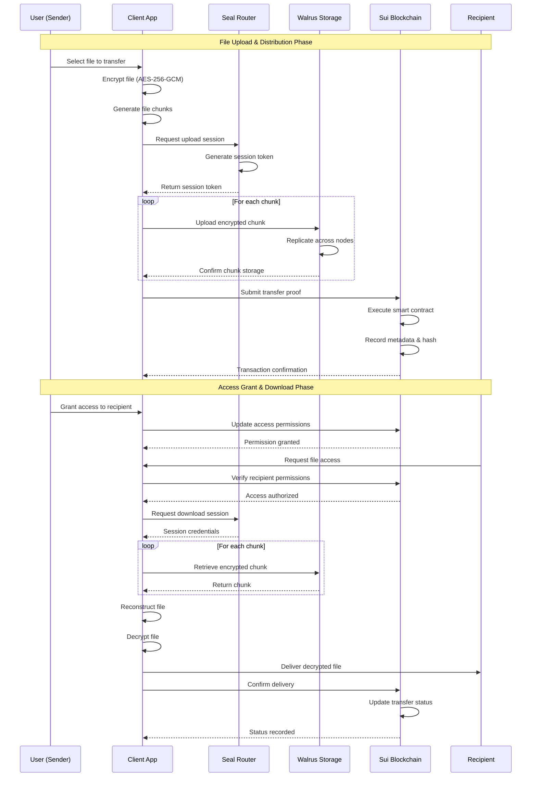

<div align="center">

# DeTransfer

### Decentralized File Transfer Protocol

[](LICENSE)
[](https://sui.io)
[](https://walrus.site)
[]()

**Secure • Decentralized • Verifiable**


[Features](#key-features) • [Architecture](#architecture) • [Getting Started](#getting-started) • [Documentation](#documentation) • [Roadmap](#roadmap)

</div>

---

## Table of Contents

- [Overview](#overview)
- [Key Features](#key-features)
- [Architecture](#architecture)
- [Workflow Diagram](#workflow-diagram)
- [Technology Stack](#technology-stack)
- [Getting Started](#getting-started)
- [Usage](#usage)
- [Smart Contracts](#smart-contracts)
- [Use Cases](#use-cases)
- [Security](#security)
- [Roadmap](#roadmap)
- [Contributing](#contributing)
- [License](#license)

---

## Overview

**DeTransfer** is a next-generation decentralized file transfer protocol that combines the power of distributed storage, blockchain verification, and secure routing to provide censorship-resistant, verifiable, and trustless data delivery.

Unlike traditional file-sharing services, DeTransfer eliminates single points of failure and central authority control by leveraging a three-layer architecture:

- **Storage Layer (Walrus)** - Decentralized storage with redundancy and high availability
- **Verification Layer (Sui)** - Blockchain-based proofs, ownership, and state management
- **Orchestration Layer (Seal)** - Routing, session management, and transfer coordination

### Why DeTransfer?

- **No Central Authority** - Fully decentralized architecture
- **Cryptographic Verification** - Every transfer is provably secure
- **Censorship Resistant** - No single entity can block or monitor transfers
- **End-to-End Encryption** - Client-side encryption ensures privacy
- **Auditable & Transparent** - On-chain proofs enable verification
- **Cross-Network Interoperability** - Seamless integration across protocols

---

## Key Features

### 1. **Secure Distributed Storage**
DeTransfer leverages **Walrus** for decentralized storage, ensuring files are:
- Chunked and encrypted before distribution
- Replicated across multiple independent nodes
- Resistant to data loss and censorship
- Available with high durability guarantees

### 2. **Blockchain-Based Verification**
**Sui** blockchain provides:
- Immutable proofs of upload and transfer
- Smart contract-based access control
- Ownership and permission management
- Transaction integrity and auditability
- Gas-efficient Move language contracts

### 3. **Intelligent Routing & Orchestration**
**Seal** manages:
- Request routing and load balancing
- Secure handshake protocols
- Session token generation and validation
- Recipient authorization workflows
- Transfer status monitoring

### 4. **End-to-End Encryption**
Security by design:
- Client-side encryption (AES-256-GCM)
- Zero-knowledge architecture
- Only authorized recipients can decrypt
- No intermediate access to plaintext data

### 5. **Comprehensive Auditability**
Every transfer generates:
- Cryptographic hashes for integrity verification
- On-chain metadata and timestamps
- Transfer history and provenance trails
- Verifiable delivery confirmations

---

## Architecture

DeTransfer follows a modular, three-layer architecture designed for scalability, security, and decentralization:

```
┌─────────────────────────────────────────────────────────────┐
│                     Client Application                      │
│            (Web/Desktop/Mobile Interface)                   │
└────────────────────┬────────────────────────────────────────┘
                     │
                     ▼
┌─────────────────────────────────────────────────────────────┐
│                   Seal Orchestration Layer                  │
│  • Request Routing        • Session Management              │
│  • Transfer Coordination  • Authorization Logic             │
└──────────┬─────────────────────────────┬────────────────────┘
           │                             │
           ▼                             ▼
┌──────────────────────┐      ┌─────────────────────────────┐
│   Walrus Storage     │      │    Sui Blockchain           │
│  • Chunk Storage     │      │  • Smart Contracts          │
│  • Replication       │      │  • Proof Verification       │
│  • Retrieval         │      │  • State Management         │
└──────────────────────┘      └─────────────────────────────┘
```

### Component Breakdown

| Component | Technology | Responsibility |
|-----------|-----------|----------------|
| **Client** | React/TypeScript | User interface, encryption, file handling |
| **Seal** | Rust | Routing, orchestration, session management |
| **Walrus** | Distributed Network | Decentralized file storage and retrieval |
| **Sui** | Move Language | Smart contracts, proofs, state verification |

---

## Workflow Diagram

### Complete Transfer Flow



### Key Workflow Steps

1. **Encryption Phase**
   - User selects file in client application
   - File is encrypted client-side using AES-256-GCM
   - Encryption key is derived from user credentials
   - File is chunked for distributed storage

2. **Upload Phase**
   - Client requests upload session from Seal
   - Seal generates and returns session token
   - Each chunk is uploaded to Walrus network
   - Walrus replicates chunks across nodes for redundancy

3. **Verification Phase**
   - Client submits transfer proof to Sui blockchain
   - Smart contract validates and records metadata
   - Cryptographic hash stored on-chain
   - Transaction confirmation returned to client

4. **Authorization Phase**
   - Sender grants access permissions via smart contract
   - Recipient identity verified on blockchain
   - Access control list updated on Sui
   - Permission events emitted for auditability

5. **Download Phase**
   - Recipient requests file through client
   - Permissions verified against blockchain state
   - Seal coordinates chunk retrieval from Walrus
   - Chunks reconstructed and decrypted client-side

6. **Confirmation Phase**
   - Delivery confirmation submitted to blockchain
   - Transfer status updated in smart contract
   - Audit trail completed with timestamps
   - Both parties notified of successful transfer

---

## Technology Stack

### Frontend
- **React 18+** - Modern UI framework
- **TypeScript** - Type-safe development
- **Vite** - Fast build tool and dev server
- **TailwindCSS** - Utility-first styling
- **Web3.js/Ethers.js** - Blockchain interaction

### Backend
- **Rust** - High-performance systems language
- **Actix-web** - Async web framework
- **Tokio** - Asynchronous runtime
- **SeaORM** - Database ORM

### Blockchain
- **Sui** - Layer 1 blockchain platform
- **Move Language** - Smart contract development
- **Sui SDK** - Blockchain integration

### Storage
- **Walrus** - Decentralized storage network
- **IPFS** - Content-addressed storage (optional)

### Security
- **AES-256-GCM** - Encryption algorithm
- **SHA-3** - Cryptographic hashing
- **Ed25519** - Digital signatures

---

## Getting Started

### Prerequisites

Ensure you have the following installed:

- **Node.js** (v18.0.0 or higher)
- **npm** or **yarn** package manager
- **Rust** (v1.70.0 or higher)
- **Sui CLI** ([Installation Guide](https://docs.sui.io/build/install))
- **Walrus Client** ([Setup Instructions](https://walrus.site))
- **Git** version control

### Installation

1. **Clone the repository**
```bash
git clone https://github.com/anbusan19/DeTransfer.git
cd DeTransfer
```

2. **Install client dependencies**
```bash
cd client
npm install
# or
yarn install
```

3. **Install Seal backend dependencies**
```bash
cd ../seal
cargo build --release
```

4. **Configure environment variables**
```bash
# Client (.env)
cp client/.env.example client/.env

# Seal (.env)
cp seal/.env.example seal/.env
```

Edit the `.env` files with your configuration:
```env
# Client environment
VITE_SUI_NETWORK=testnet
VITE_WALRUS_ENDPOINT=https://walrus-testnet.example.com
VITE_SEAL_API=http://localhost:8080

# Seal environment
SEAL_PORT=8080
SUI_RPC_URL=https://fullnode.testnet.sui.io:443
WALRUS_API_KEY=your_api_key_here
```

### Running the Application

#### 1. Start the Seal Backend
```bash
cd seal
cargo run --release
```

#### 2. Deploy Sui Smart Contracts
```bash
cd contracts
sui move build
sui client publish --gas-budget 100000000
```

Save the package ID from deployment output.

#### 3. Start the Client Application
```bash
cd client
npm run dev
# or
yarn dev
```

The application will be available at `http://localhost:5173`

### Docker Setup (Alternative)

```bash
# Build and run with Docker Compose
docker-compose up -d

# View logs
docker-compose logs -f

# Stop services
docker-compose down
```

---

## Usage

### Upload a File

```typescript
import { DeTransferClient } from '@detransfer/sdk';

const client = new DeTransferClient({
  sealEndpoint: 'http://localhost:8080',
  suiNetwork: 'testnet',
  walrusEndpoint: 'https://walrus-testnet.example.com'
});

// Upload file
const result = await client.upload({
  file: fileBlob,
  recipients: ['0x1234...', '0x5678...'],
  expiresAt: Date.now() + 86400000, // 24 hours
  encryption: 'AES-256-GCM'
});

console.log('File ID:', result.fileId);
console.log('Transaction:', result.txHash);
```

### Download a File

```typescript
// Download file
const file = await client.download({
  fileId: 'abc123...',
  recipient: '0x1234...'
});

// Save to disk
const blob = new Blob([file.data]);
saveAs(blob, file.metadata.filename);
```

### Grant Access

```typescript
// Grant access to new recipient
await client.grantAccess({
  fileId: 'abc123...',
  recipient: '0x9abc...',
  permissions: ['read', 'download']
});
```

### Verify Transfer

```typescript
// Verify file integrity
const verification = await client.verify({
  fileId: 'abc123...',
  expectedHash: 'sha3-256-hash...'
});

console.log('Verified:', verification.isValid);
console.log('On-chain proof:', verification.proofTx);
```

---

## Smart Contracts

### Core Contracts

#### FileTransfer.move
Main contract managing file transfers and permissions.

```move
module detransfer::file_transfer {
    use sui::object::{Self, UID};
    use sui::transfer;
    use sui::tx_context::{Self, TxContext};
    
    struct FileMetadata has key, store {
        id: UID,
        owner: address,
        file_hash: vector<u8>,
        chunk_count: u64,
        recipients: vector<address>,
        created_at: u64,
        expires_at: u64
    }
    
    public entry fun create_transfer(
        file_hash: vector<u8>,
        chunk_count: u64,
        recipients: vector<address>,
        expires_at: u64,
        ctx: &mut TxContext
    ) {
        // Implementation
    }
}
```

### Contract Deployment

```bash
# Build contracts
sui move build

# Run tests
sui move test

# Deploy to testnet
sui client publish --gas-budget 100000000

# Deploy to mainnet
sui client publish --gas-budget 100000000 --network mainnet
```

---

## Use Cases

### Enterprise Solutions
- **Secure Document Sharing** - Legal, financial, and confidential documents
- **Cross-Organization Collaboration** - Trustless file exchange between partners
- **Compliance & Audit Trails** - Verifiable proof of delivery and access logs
- **Decentralized Backups** - Critical data redundancy without central servers

### Individual Users
- **Privacy-Focused Sharing** - End-to-end encrypted personal files
- **Large File Transfers** - Bypass email and cloud storage limits
- **Permanent Storage** - Long-term archival with guaranteed availability
- **Whistleblower Protection** - Anonymous and secure document submission

### Developers
- **dApp File Storage** - Integrate decentralized storage in applications
- **NFT Metadata Storage** - Store NFT assets with verifiable proofs
- **Decentralized CDN** - Content delivery without centralized infrastructure
- **Web3 Infrastructure** - Build on trustless file transfer primitives

---

## Security

### Security Measures

- **Client-Side Encryption** - All files encrypted before leaving user's device
- **Key Management** - Hierarchical deterministic key derivation
- **Zero-Knowledge Architecture** - No intermediate access to plaintext
- **Cryptographic Proofs** - SHA-3 hashing and Ed25519 signatures
- **Smart Contract Audits** - Regular security reviews and audits
- **Rate Limiting** - DDoS protection and abuse prevention

### Security Best Practices

1. **Never share your private keys**
2. **Verify recipient addresses before granting access**
3. **Use strong, unique passwords for encryption**
4. **Regularly update client software**
5. **Monitor transfer activity on blockchain explorers**

### Vulnerability Reporting

Found a security issue? Please report it responsibly:
- Email: security@detransfer.io
- PGP Key: [Download](https://detransfer.io/pgp)
- Bug Bounty: [Program Details](https://detransfer.io/bounty)

---

## Roadmap

### Q1 2026
- [x] Core protocol development
- [x] Sui smart contracts deployment
- [x] Walrus integration
- [ ] Public testnet launch
- [ ] Security audit completion

### Q2 2026
- [ ] Multi-device session synchronization
- [ ] Temporary share links with programmable expiry
- [ ] Advanced access control (time-based, usage-limited)
- [ ] Mobile applications (iOS/Android)

### Q3 2026
- [ ] Desktop applications (Windows/macOS/Linux)
- [ ] Privacy-preserving audit trails with zero-knowledge proofs
- [ ] Enterprise API and SDK
- [ ] Mainnet deployment

### Q4 2026
- [ ] Cross-chain bridges for multi-blockchain support
- [ ] Decentralized governance implementation
- [ ] Advanced analytics dashboard
- [ ] Third-party integrations and partnerships

### Future Vision
- Decentralized identity integration (DID)
- AI-powered file organization and search
- Layer 2 scaling solutions
- Global CDN with edge caching

---

## Contributing

We welcome contributions from the community! Here's how you can help:

### Ways to Contribute

- **Report Bugs** - Submit detailed bug reports
- **Suggest Features** - Propose new ideas and enhancements
- **Improve Documentation** - Help us maintain clear docs
- **Submit Pull Requests** - Contribute code improvements

### Development Workflow

1. Fork the repository
2. Create your feature branch (`git checkout -b feature/AmazingFeature`)
3. Commit your changes (`git commit -m 'Add some AmazingFeature'`)
4. Push to the branch (`git push origin feature/AmazingFeature`)
5. Open a Pull Request

### Coding Standards

- Follow Rust style guidelines (rustfmt)
- Use ESLint and Prettier for TypeScript/React
- Write comprehensive tests for new features
- Update documentation for API changes
- Maintain backward compatibility when possible

---

## License

This project is licensed under the **MIT License** - see the [LICENSE](LICENSE) file for details.

---

## Contact & Support

- **Website**: [https://detransfer.io](https://detransfer.io)
- **Documentation**: [https://docs.detransfer.io](https://docs.detransfer.io)
- **Twitter**: [@DeTransfer](https://twitter.com/detransfer)
- **Discord**: [Join our community](https://discord.gg/detransfer)
- **Email**: support@detransfer.io

---

## Acknowledgments

Special thanks to:
- **Sui Foundation** - For blockchain infrastructure and support
- **Walrus Team** - For decentralized storage solutions
- **Open Source Community** - For tools and libraries
- **Early Contributors** - For testing and feedback

---

<div align="center">

**Built for a decentralized future**

[Back to Top](#detransfer)

</div>

